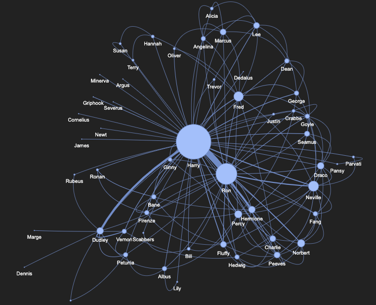
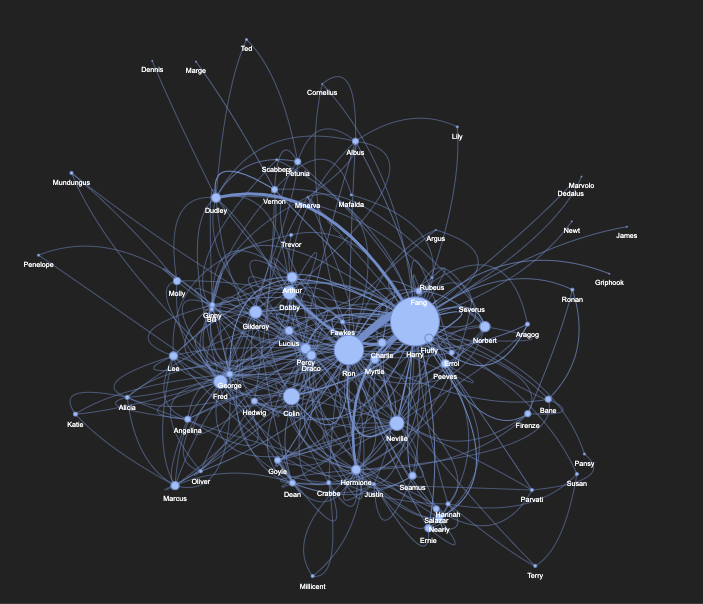
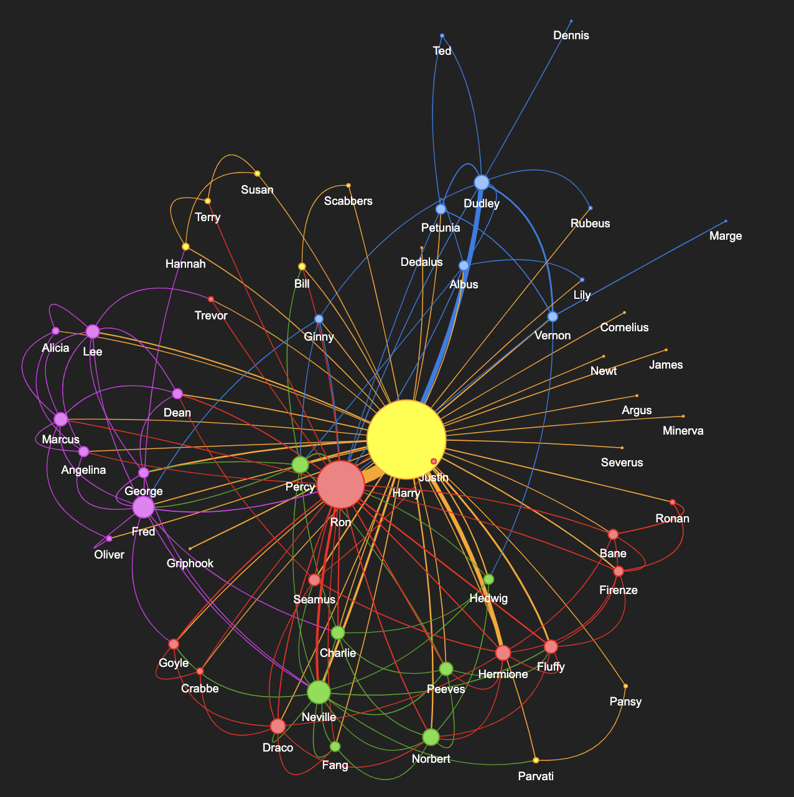
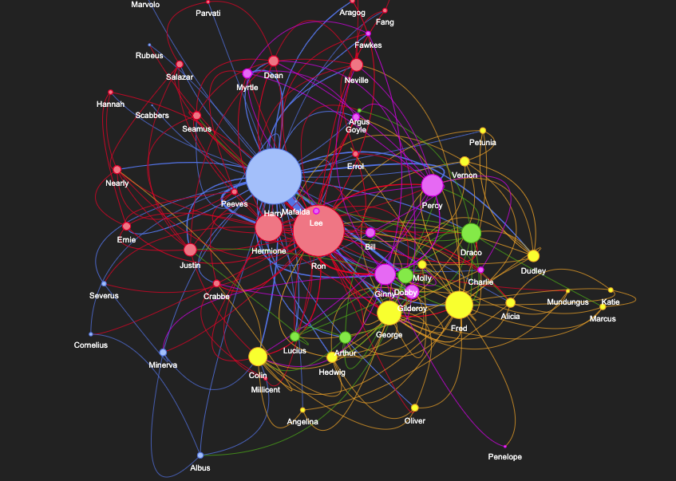
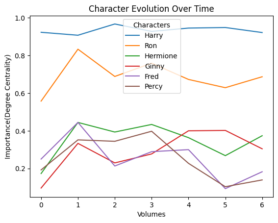

# EDISS-DS-MINI3

## Abstract
In this mini project, the author employs network analysis, built upon Named Entity Recognition (NER), to explore the intricate dynamics of the Harry Potter series. The analysis covers co-occurrence patterns, character network construction, community detection, centrality analysis, and tracking character evolution. By scrutinizing character relationships, the project aims to reveal hidden narrative dynamics, providing a unique perspective on the wizarding world through the lens of data science.

## 1. Introduction
The project introduces the intersection of literature and machine learning, highlighting the synergy between storytelling and data analysis. The Harry Potter series, with its rich character tapestry, serves as an ideal subject for exploration. The goal is to use network analysis to deconstruct character connections and delve into the narrative dynamics of the beloved literary masterpiece.

## 2. Data Preparation and Preprocessing
The project utilizes seven plain text volumes of the Harry Potter series and a JSON file containing character names. Named Entity Recognition (NER) is employed to extract character entities on a per-sentence basis. The preprocessing involves filtering recognized entities, defining co-occurrence parameters, and aggregating co-occurrence data for further analysis.

## 3. Network Analysis
### 3.1 Visualization of Networks
The author uses NetworkX to generate graph objects, and Pyvis for visually stunning, interactive network visualizations. Observations include the complexity of character networks, the consistent centrality of Harry Potter, the presence of specific characters in certain volumes, and the evolution of networks across volumes.

### 3.2 Centrality Measures
Degree centrality, betweenness centrality, and closeness centrality are employed to identify influential characters within each volume. Harry Potter consistently ranks highest, with variations based on the centrality measure applied. The centrality analysis provides insights into the structural dynamics of the character networks.

### 3.3 Community Detection
The Louvain method is used for community detection, revealing clusters of characters with frequent interactions. The communities evolve across volumes, offering insights into the social fabric of the Harry Potter series.

### 3.4 Evolution of Characters
Character evolution is assessed using degree centrality. The analysis highlights the top influential characters over time and the fastest changing characters. Harry Potter emerges as the most influential character throughout the series.

## 4. Conclusion
The project concludes by emphasizing the convergence of storytelling and data science through network analysis. The characters of Harry Potter are explored in new dimensions, showcasing the power of literature when coupled with precise data analysis. The project stands as a testament to the limitless possibilities when literature and data science intersect, offering fresh perspectives on beloved literary masterpieces.
